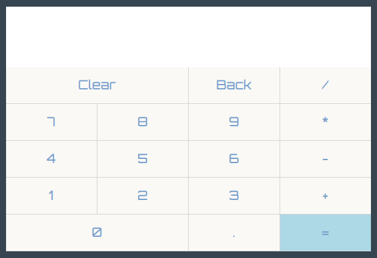

# Browser-based Calculator
This is an implementation of a calculator in a web browser.
## Description

This project is a more challenging exercise in using javascript fundamentals. Some of those included manipulating not only the DOM, but also the data and the data structures that they're in. It also pushed me to learn about connecting DOM elements to keyboard strokes. The project was provided by [the odin project](https://www.theodinproject.com/paths/foundations/courses/foundations/lessons/calculator). The site can be seen [here](https://libmartinito.github.io/calc).
